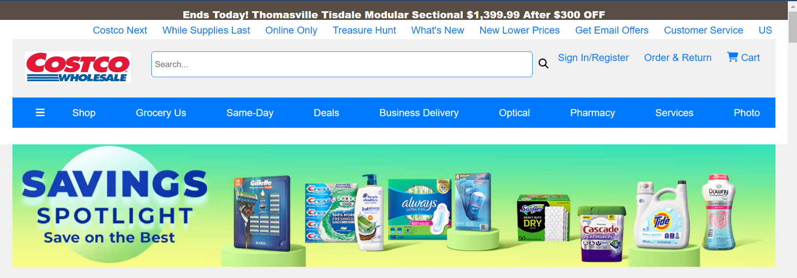
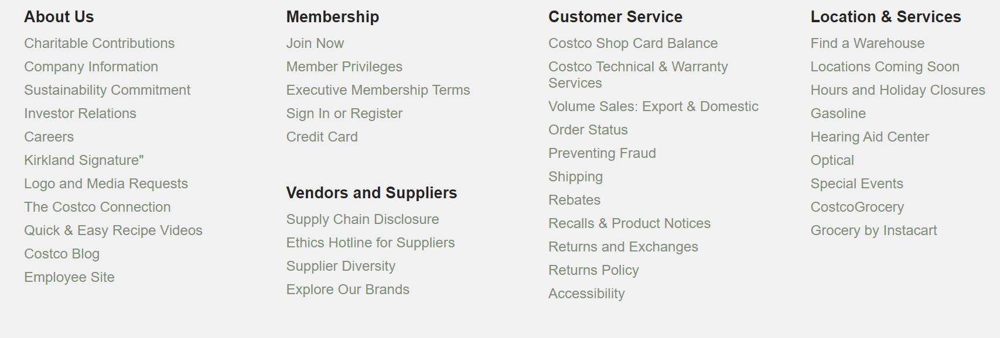

# Costco.com Clone

This project is a clone of the Costco.com website, created using HTML, CSS, and minimal JavaScript. The purpose of this project is to demonstrate proficiency in web development by replicating the design and layout of a well-known e-commerce website.

## Project Overview

This project replicates the layout and design of Costco.com, providing a static version of the website using primarily HTML and CSS. Minimal JavaScript is used to add basic interactivity, such as navigation menu toggles and form validations.

## Features

- Responsive design for various screen sizes
- Navigation bar with dropdown menus
- Product listings with images and descriptions
- Individual product pages with detailed information
- Footer with links and contact information

## ## Technologies Used

- **HTML:** For creating the structure and content of the web pages.
- **CSS:** For styling the web pages and making them visually appealing.
- **JavaScript:** Used minimal JS to add basic interactive features like navigation toggles and form validations.

## Screenshots:

### ### Homepage

### Product Listing Page

### User Registration Page

### Footer

